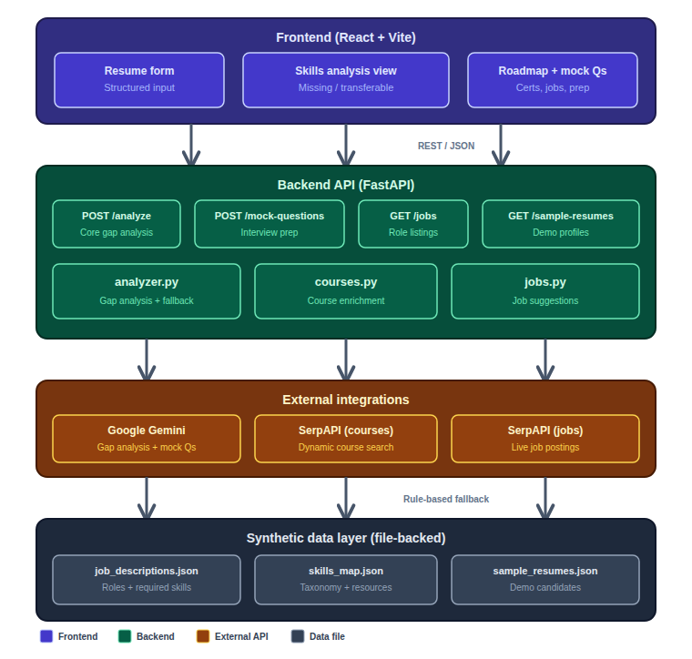

# SkillBridge – Design Document

## 1. Problem & Goals

Students and professionals looking to switch careers often face a gap between their current skills and the requirements of their target roles. It can be hard to pinpoint:

- Which skills are **missing** for a target role.
- Which skills from past experience are **transferable**.
- What **learning path** and **certifications** they should follow 
- How to **practice** via targeted interview questions.

**Goal:** Build a small, end‑to‑end “career navigator” that:

- Ingests a structured, resume‑like profile through a web form
- Compares it to job descriptions for a target role.
- Produces:
  - Missing vs transferable skills.
  - An AI powered prioritized learning roadmap with resources and certification suggestions.
  - Experience‑aware job suggestions.
  - AI generated role‑specific mock interview questions based on the role

---

## 2. High‑Level Architecture


The solution has three main pieces:

1. **Backend API (FastAPI)**
   - Endpoints for skills gap analysis, job/role metadata, sample resumes, and mock interview questions.
   - Integrates:
     - Google Gemini for AI‑powered analysis
     - SerpAPI to fetch course/certification dynamically along with live job postings.
   - Provides a deterministic, rule‑based fallback when AI or SerpAPI is unavailable.

2. **Frontend (React + Vite)**
   - Structured form that captures resume‑like data (experience, skills, projects, certs).
   - Calls the backend to run analysis and display:
     - Missing/transferable skills.
     - Learning roadmap.
     - Relevant job postings.

3. **Synthetic Data Layer**
   - `job_descriptions.json` – representative roles with required/nice‑to‑have skills.
   - `skills_map.json` – skills with static learning resources.
   - `sample_resumes.json` – example candidate profiles for testing and demos.

Everything is stateless and file‑backed (no database) to keep the focus on reasoning, integrations, and robustness.

---

## 3. Backend Design

### 3.1. Main API Surface (`app/main.py`)

Endpoints:

- `GET /`
  - Health check payload + pointer to `/docs`.

- `GET /roles`
  - Returns distinct job titles from `data/job_descriptions.json`.

- `GET /jobs?role=...`
  - Returns job descriptions, optionally filtered by a substring match on title.

- `POST /analyze` (core endpoint)
  - Input: `AnalyzeRequest`:
    - `resume_text: str`
    - `target_role: str`
    - `experience_level: Optional[str]` (`junior` | `mid` | `senior`)
  - Steps:
    1. Validate non‑empty `resume_text` and `target_role`.
    2. Load all synthetic JDs from `job_descriptions.json`.
    3. Filter JDs whose `title` contains the target role string (fallback to all if none match).
    4. Call `analyze_gap` with `resume_text`, `target_role`, `matching_jds`, `experience_level`.
    5. Return `AnalyzeResponse`.

- `GET /sample-resumes`
  - Returns `data/sample_resumes.json` for demos and quick testing.

Logic is implemented by `analyzer.py`, `jobs.py`, and `courses.py`.

---

### 3.2. Core Analysis Logic (`app/analyzer.py`)

#### 3.2.1. Data & helpers

- `DATA_DIR` – root for JSON data files.
- `_load_skills_map()` – loads `skills_map.json`.
- `_extract_skills_from_resume(resume_text, all_known_skills)`:
  - Lowercases the resume and does simple substring checks for each known skill.
- `_aggregate_required_skills(job_descriptions)`:
  - Deduplicated union of all `required_skills` from matching JDs.

#### 3.2.2. AI path: Gemini‑powered gap analysis

- `_build_user_prompt(resume_text, target_role, job_descriptions)`:
  - Prompt includes:
    - Target role.
    - Full resume text.
    - Summarized job descriptions (title + required/nice‑to‑have skills).
  - Strong instructions to return only JSON with keys:
    - `missing_skills`
    - `transferable_skills`
    - `roadmap` (with `skill`, `why`, `free_resource`, `paid_resource`, `estimated_weeks`)
    - `summary`
  - Roadmap constraints:
    - Max 6 items.
    - Only missing skills.
    - Ordered by impact.
    - Realistic `estimated_weeks` (1–8).

- `_call_gemini(...) -> AnalyzeResponse | None`:
  - Reads `GEMINI_API_KEY`; if missing → returns `None`.
  - Calls `gemini-2.5-flash` with low temperature for deterministic JSON.
  - Strips possible ```json fences and parses JSON.
  - Instantiates `RoadmapItem` models.
  - Dynamically retrieves relevant courses via `enrich_roadmap_with_serpapi`.
  - Returns `AnalyzeResponse(ai_powered=True)`.
  - On any exception, logs and returns `None`.

This path provides the primary, AI‑powered analysis when available.

#### 3.2.3. Rule‑based fallback

- `_rule_based_fallback(resume_text, target_role, job_descriptions) -> AnalyzeResponse`:

  1. Load `skills_map`.
     - Flatten `categories` into `all_known_skills`.

  2. Extract skills from the resume via `_extract_skills_from_resume`.

  3. Compute:
     - `required_skills` via `_aggregate_required_skills`.
     - `missing = required_skills - resume_skills`.
     - `transferable` = skills present in resume that are either required or in the taxonomy.

  4. Build roadmap:
     - Up to 6 missing skills.
     - Use static `learning_resources` or generic fallbacks.
     - Each `RoadmapItem` includes a simple `why` and default `estimated_weeks=2`.

  5. Dynamically search for courses using SerpAPI via `enrich_roadmap_with_serpapi`.

  6. Build a summary string that:
     - Mentions transferable vs missing skills counts.
     - Clearly states when the rule‑based fallback was used.

  7. Return `AnalyzeResponse(ai_powered=False)`.

This guarantees a reasonable roadmap even without AI.

#### 3.2.4. Experience‑aware job suggestions

- `analyze_gap(resume_text, target_role, job_descriptions, experience_level)`:

  1. Try `_call_gemini` first.
  2. If it returns `None`, fall back to `_rule_based_fallback`.
  3. Call `fetch_relevant_jobs_for_role(target_role, experience_level)` from `jobs.py`.
  4. Attach any returned `SuggestedJob`s to `result.suggested_jobs`.
  5. Return the final `AnalyzeResponse`.

---

## 4. SerpAPI Integrations

### 4.1. Courses and certifications (`app/courses.py`)

- `CERT_FALLBACK`:
  - Static mapping from skills to well‑known certifications.
- `_fetch_certifications_for_skill(skill, api_key)`:
  - Google web search for `"<skill> certification"`.
  - Filters titles containing “certification”/“certified”.
  - Deduplicates and returns up to 2 titles.
- `enrich_roadmap_with_serpapi(roadmap)`:
  - If `SERPAPI_KEY` missing:
    - Only attaches `certifications` from `CERT_FALLBACK`.
  - Else:
    - For each `RoadmapItem`:
      - Search `"<skill> coursera course"`.
      - Override `free_resource` / `paid_resource` with top results.
      - Attach dynamic certs or fall back to `CERT_FALLBACK`.

### 4.2. Live job postings (`app/jobs.py`)

- `_title_matches_experience(title, experience_level)`:
  - For `junior`: rejects titles with senior markers (e.g. "Senior", "Lead", "Principal").
  - For other levels: allows all.

- `fetch_relevant_jobs_for_role(role, experience_level=None)`:
  - Builds a search query from `role` plus an experience hint.
  - Normalizes results into `SuggestedJob` objects with `title`, `company`, `location`, `link`, `snippet`.
  - Caps at 5 jobs.
  - Returns `[]` on missing key or errors.

---

Each module is decoupled from the other to ensure failure of one does not break the flow of the application
---

## 6. Frontend Design (`frontend/src/App.jsx`)

### 6.1. Data flow

1. User fills structured form:
   - Basic info: name, education.
   - Experiences: role, company, duration, bullet points.
   - Skills, projects, certifications (comma‑separated).
   - Target role (from `/roles`).
   - Experience level.

2. `buildResumeTextFromForm` converts form state into a `resume_text` string.

3. `handleAnalyze`:
   - Validates `resume_text` and `targetRole`.
   - Calls `POST /api/analyze` with `{ resume_text, target_role, experience_level }`.
   - Renders:
     - Summary.
     - Missing/transferable skills grid.
     - Learning roadmap with resources and recommended certs.
     - Relevant job postings if present.

### 6.2. Layout & UX

- Single‑page layout with sticky header and card‑based sections.
- Clear separation:
  - Form → Analyze → Results.

---

## 7. Testing Strategy (`tests/test_api.py`)

Tests cover:

- `/analyze`:
  - AI path with mocked Gemini (ensuring `ai_powered=True` and correct fields).
  - Rule‑based fallback path when no key or on error.
  - Edge cases: empty inputs, unknown roles, resumes that already cover all skills.
  - Ensuring roadmap is capped at 6 items.

- Supporting endpoints:
  - `/roles`, `/jobs`, `/sample-resumes` basic behavior.

- Helper functions:
  - `_extract_skills_from_resume` behavior and edge cases.
  - Experience‑aware filtering in `fetch_relevant_jobs_for_role`.

---

## 8. Tradeoffs & Future Work

- No database or auth; all data comes from JSON files.
- Due to semantic skill matching and free-tier APIs, the summary might not be the most accurate
- Synthetic JDs cover a limited set of roles; expanding them or integrating a real job feed would improve realism.
- Resume has to be typed in manually as PDF parsing and extraction not supported
- Add mock interview questions

Despite these tradeoffs, the design demonstrates:

- Clear separation of concerns.
- Appropriate use of AI with strong fallbacks.
- Integration of synthetic and live data to give users a concrete, actionable learning and interview preparation plan.
