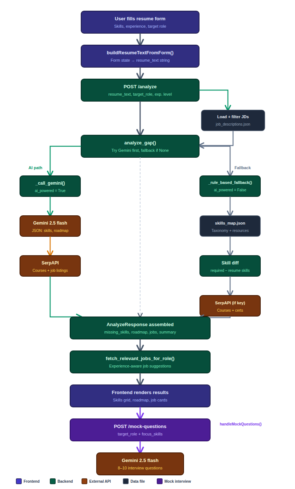

# SkillBridge Career Navigator

> AI-powered skill gap analysis and personalized learning roadmap generator.
Demo Video: https://www.youtube.com/watch?v=2iGeQhy-src
---

**Candidate Name**: Srishaatvika Selvam 

**Scenario Chosen**: Scenario 2 — Skill-Bridge Career Navigator

**Estimated Time Spent**: 5 - 6 hours 

---

## Quick Start

### Prerequisites
- Python 3.11+
- Node.js 18+ (for frontend)
- Gemini API key (`GEMINI_API_KEY`) for AI-powered analysis
- SerpAPI key (`SERPAPI_KEY`) for live courses/certifications/job suggestions

### Setup

```bash
# 1. Clone the repo
git clone https://github.com/Shaatvika/SkillBridge.git
cd skillbridge

# 2. Backend
cp .env.example .env
# Edit .env and add your GEMINI_API_KEY and SERPAPI_KEY if available

#To obtain your SerpAPI key follow this article [https://dev.to/codebangkok/create-serpapi-google-search-api-key-1nn3](https://dev.to/codebangkok/create-serpapi-google-search-api-key-1nn3)
pip install -r requirements.txt

# 3. Run the API
uvicorn app.main:app --reload # API docs available at http://localhost:8000/docs

# 4. Frontend (separate terminal)
cd frontend
npm install
npm run dev
# Open http://localhost:5173
```

### Test Commands

```bash
# Run all tests
pytest tests/ -v
```

---
### Project Structure

```text
skillbridge/
├── app/
│   ├── __init__.py
│   ├── analyzer.py         # Core gap analysis + Gemini 
│   ├── courses.py          # SerpAPI course/certification enrichment
│   ├── jobs.py             # SerpAPI job search + experience filtering
│   ├── main.py             # FastAPI app and API endpoints
│   └── models.py           # Pydantic request/response models
├── data/
│   ├── job_descriptions.json  # Synthetic JDs with required/nice‑to‑have skills
│   ├── sample_resumes.json    # Example resumes for demos/tests
│   └── skills_map.json        # Skill taxonomy + static learning resources
├── frontend/
│   ├── index.html
│   ├── package.json
│   ├── vite.config.js
│   └── src/
│       ├── App.jsx         # Main React SPA: form, results, mock interview UI
│       ├── index.css
│       └── main.jsx        # React entrypoint
├── tests/
│   ├── __init__.py
│   └── test_api.py         # End‑to‑end API and helper tests (incl. mock questions)
├── DESIGN.md               # Detailed design & architecture
├── README.md               # Project overview, setup, and usage
```
### API Endpoints

| Method | Endpoint           | Description                                                        |
|--------|--------------------|--------------------------------------------------------------------|
| GET    | `/`                | Health check                                                      |
| GET    | `/roles`           | List available job titles                                         |
| GET    | `/jobs?role=...`   | Get job descriptions (filterable by role substring)               |
| POST   | `/analyze`         | Core: resume + role → gap analysis, learning roadmap, job leads   |
| GET    | `/sample-resumes`  | Synthetic resumes for quick experiments

### Core Flow


---

## Key Features

### 1. AI-Powered Gap Analysis (with Safe Fallback)
### 2. Live Courses & Certifications via SerpAPI
### 3. Experience-Aware Job Suggestions
### 4. Structured Resume Form (Frontend)
---

## AI & Tooling Disclosure

- **AI assistants used:** GitHub Copilot (coding), Gemini for some prompt experiments.
- **How suggestions were validated:**
  - Read and edited all generated code before committing.
  - Added tests around the core `/analyze` flow, AI fallback, and helper functions.
  - Manually exercised the UI against several roles and resumes.
- **Important customization:**
  - Prompt tuned to enforce **raw JSON only** from Gemini, with a defensive strip of markdown fences
    before `json.loads()` to avoid subtle parsing failures.
---

## Tradeoffs & Next Steps

### Tradeoffs
- No database or authentication — everything is request-scoped and reads from JSON files.
- Experience-level heuristics for job titles are intentionally simple (keyword-based) to keep logic transparent.
- The resume has to be manually entered in the form instead of a simple file upload

### If I had more time
1. Implemented a resume parser tool to read directly from the file
2. Dynamically sourced 100+ JDs and extracted skills from those instead of synthetic JSON files
3. Enabled users to compare between multiple target roles
---

